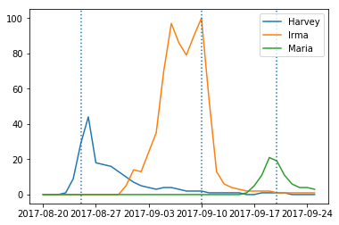

## Data Visualization

```python
# then we can plot the x-axis as a date object instead of dealing with a 
# clutter of dates as strings
plt.plot(google_trends_date_objects, google_trends['Harvey_US'], label = "Harvey")
plt.plot(google_trends_date_objects, google_trends['Irma_US'], label = "Irma")
plt.plot(google_trends_date_objects, google_trends['Maria_US'], label = "Maria")
plt.axvline(x=dt.datetime.strptime("9/20/17", '%m/%d/%y').date(), linestyle = 'dotted')
plt.axvline(x=dt.datetime.strptime("8/25/17", '%m/%d/%y').date(), linestyle = 'dotted')
plt.axvline(x=dt.datetime.strptime("9/10/17", '%m/%d/%y').date(), linestyle = 'dotted')
plt.legend(loc='best')

plt.show()
```


